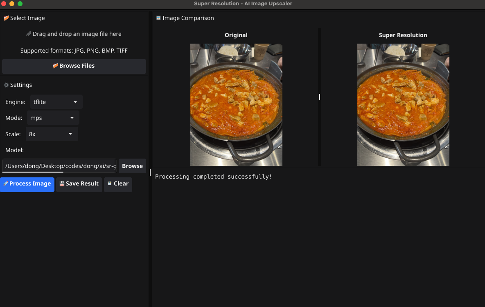

# Super Resolution - AI Image Upscaler

A powerful, cross-platform application for AI-powered image super-resolution with both CLI and GUI interfaces. Enhance image quality using multiple AI engines including ESRGAN, with support for various hardware acceleration options.



## 🌟 Features

### 🖼️ **Dual Interface**
- **GUI Application**: Intuitive drag-and-drop interface with side-by-side comparison
- **CLI Tool**: Command-line interface for batch processing and automation

### 🤖 **Multiple AI Engines**
- **OpenCV**: Fast traditional upscaling algorithms
- **ONNX**: AI model inference via ONNX Runtime
- **TensorFlow**: Full TensorFlow model support
- **TensorFlow Lite**: Lightweight AI inference for mobile/edge devices

### 🚀 **Hardware Acceleration**
- **CPU**: Works on all platforms
- **GPU**: CUDA acceleration for NVIDIA graphics cards
- **MPS**: Metal Performance Shaders for macOS (Apple Silicon & Intel)

### 📏 **Flexible Scaling**
- **Scale Factors**: 2x, 4x, 8x image enhancement
- **Custom Dimensions**: Specify exact output width/height
- **Aspect Ratio**: Maintain proportions with single dimension input

### 🎯 **Model Support**
- **ONNX Models**: `.onnx` files (Real-ESRGAN, ESRGAN variants)
- **TensorFlow**: `.pb` SavedModel format
- **TensorFlow Lite**: `.tflite` optimized models
- **Real-ESRGAN**: State-of-the-art photo enhancement

## 🚀 Quick Start

### GUI Application

1. **Run the GUI**:
   ```bash
   ./sr-gui
   ```

2. **Select Image**: Drag & drop or browse for an image file

3. **Configure Settings**:
   - Choose engine (OpenCV for quick testing)
   - Select hardware mode (CPU/GPU/MPS)
   - Pick scale factor or custom dimensions

4. **Process**: Click "🚀 Process Image" and watch the magic happen!

5. **Save**: Export your enhanced image with "💾 Save Result"

### CLI Tool

```bash
# Basic usage - 4x upscaling with OpenCV
./main -input photo.jpg -output photo_4x.jpg

# AI-powered with ONNX model
./main -input photo.jpg -output photo_enhanced.jpg -engine onnx -model models/Real-ESRGAN-x4plus.onnx

# Custom dimensions
./main -input photo.jpg -output photo_hd.jpg -width 1920 -height 1080

# GPU acceleration
./main -input photo.jpg -output photo_4x.jpg -engine onnx -mode gpu

# MPS on macOS
./main -input photo.jpg -output photo_4x.jpg -engine onnx -mode mps
```

## 📋 Installation

### Prerequisites

1. **Go 1.21+**: Required for building from source
2. **OpenCV**: Required for image processing
3. **pkg-config**: Required for OpenCV integration

#### macOS
```bash
brew install opencv pkg-config
```

#### Ubuntu/Debian
```bash
sudo apt-get install libopencv-dev pkg-config
```

#### Windows
```bash
# Download OpenCV from https://opencv.org/releases/
# Or use vcpkg: vcpkg install opencv
```

### Build from Source

```bash
git clone <repository>
cd sr-go
go mod tidy

# Build CLI tool
go build -o main main.go

# Build GUI application
go build -o sr-gui sr-gui.go types.go
```

### Cross-Platform Build

```bash
# Use the build script for all platforms
chmod +x build.sh
./build.sh
```

## 🎮 GUI Application

### Interface Overview


The GUI provides an intuitive interface with the following components:

1. **Left Panel**:
   - **Drop Zone**: Drag & drop image files or browse
   - **Settings**: Engine, mode, scale, and model selection
   - **Controls**: Process, save, and clear buttons

2. **Right Panel**:
   - **Image Comparison**: Side-by-side original and enhanced images
   - **Status Bar**: Real-time progress and information

### Usage Workflow

1. **Select Image**:
   - Drag and drop an image file into the drop zone
   - Or click "📁 Browse Files" to select an image
   - Supports: JPG, PNG, BMP, TIFF formats

2. **Configure Settings**:
   - **Engine**: Choose processing method
   - **Mode**: Select hardware acceleration
   - **Scale**: Pick enhancement factor or custom dimensions
   - **Model**: Browse for AI model file (ONNX/TensorFlow engines)

3. **Process Image**:
   - Click "🚀 Process Image"
   - Watch real-time progress
   - View enhanced result alongside original

4. **Save Result**:
   - Click "💾 Save Result"
   - Choose output format and location

### Keyboard Shortcuts

| Shortcut | Action |
|----------|--------|
| **Ctrl+O** | Open image file |
| **Ctrl+S** | Save result |
| **Ctrl+R** | Process image |
| **Ctrl+C** | Clear images |

## 💻 CLI Tool

### Basic Usage

```bash
# Show help
./main -help

# Basic upscaling
./main -input photo.jpg -output photo_4x.jpg

# With specific engine and mode
./main -input photo.jpg -output photo_4x.jpg -engine onnx -mode cpu
```

### Command Line Options

| Option | Description | Default | Examples |
|--------|-------------|---------|----------|
| `-input` | Input image path (required) | - | `photo.jpg` |
| `-output` | Output image path (required) | - | `result.jpg` |
| `-engine` | Processing engine | `opencv` | `opencv`, `onnx`, `tensorflow`, `tflite` |
| `-mode` | Hardware acceleration | `cpu` | `cpu`, `gpu`, `mps` |
| `-scale` | Scale factor | `4` | `2`, `4`, `8` |
| `-width` | Target width (custom) | `0` | `1920` |
| `-height` | Target height (custom) | `0` | `1080` |
| `-model` | AI model file path | `models/esrgan.onnx` | `path/to/model.onnx` |

### Examples

#### Scale Factor Enhancement
```bash
# 2x upscaling
./main -input photo.jpg -output photo_2x.jpg -scale 2

# 4x upscaling (default)
./main -input photo.jpg -output photo_4x.jpg -scale 4

# 8x upscaling
./main -input photo.jpg -output photo_8x.jpg -scale 8
```

#### Custom Dimensions
```bash
# Full HD (1920x1080)
./main -input photo.jpg -output photo_hd.jpg -width 1920 -height 1080

# 4K (3840x2160)
./main -input photo.jpg -output photo_4k.jpg -width 3840 -height 2160

# Width only (maintains aspect ratio)
./main -input photo.jpg -output photo_wide.jpg -width 1920

# Height only (maintains aspect ratio)
./main -input photo.jpg -output photo_tall.jpg -height 1080
```

#### AI Model Processing
```bash
# ONNX model with CPU
./main -input photo.jpg -output enhanced.jpg -engine onnx -mode cpu

# ONNX model with GPU
./main -input photo.jpg -output enhanced.jpg -engine onnx -mode gpu

# TensorFlow model
./main -input photo.jpg -output enhanced.jpg -engine tensorflow -model models/esrgan.pb

# TensorFlow Lite model
./main -input photo.jpg -output enhanced.jpg -engine tflite -model models/esrgan.tflite
```

#### Hardware Acceleration
```bash
# CPU processing (all platforms)
./main -input photo.jpg -output result.jpg -mode cpu

# GPU processing (NVIDIA CUDA)
./main -input photo.jpg -output result.jpg -mode gpu

# MPS processing (macOS Metal)
./main -input photo.jpg -output result.jpg -mode mps
```

## 🔧 Engine Configuration

### OpenCV Engine
- **Description**: Traditional upscaling algorithms
- **Model Required**: ❌ No
- **Performance**: Fast
- **Quality**: Good for quick enhancement

```bash
./main -input photo.jpg -output result.jpg -engine opencv -mode cpu
```

### ONNX Engine
- **Description**: AI model inference via ONNX Runtime
- **Model Required**: ✅ `.onnx` file
- **Performance**: Medium
- **Quality**: Excellent with proper models

```bash
./main -input photo.jpg -output result.jpg -engine onnx -model models/Real-ESRGAN-x4plus.onnx
```

### TensorFlow Engine
- **Description**: Full TensorFlow model support
- **Model Required**: ✅ `.pb` file
- **Performance**: Medium
- **Quality**: Excellent with proper models

```bash
./main -input photo.jpg -output result.jpg -engine tensorflow -model models/esrgan.pb
```

### TensorFlow Lite Engine
- **Description**: Lightweight AI inference
- **Model Required**: ✅ `.tflite` file
- **Performance**: Fast
- **Quality**: Good, optimized for mobile

```bash
./main -input photo.jpg -output result.jpg -engine tflite -model models/esrgan.tflite
```

## 🎯 Model Files

### Where to Get Models

1. **Real-ESRGAN**:
   - GitHub: https://github.com/xinntao/Real-ESRGAN
   - HuggingFace: https://huggingface.co/qualcomm/Real-ESRGAN-x4plus

2. **ESRGAN Models**:
   - Original paper: https://arxiv.org/abs/1809.00219
   - Pre-trained models: Various GitHub repositories

3. **ONNX Models**:
   - ONNX Model Zoo: https://github.com/onnx/models
   - Convert from PyTorch/TensorFlow

### Model Format Support

| Format | Extension | Engine | Description |
|--------|-----------|---------|-------------|
| **ONNX** | `.onnx` | ONNX | Cross-platform AI models |
| **TensorFlow** | `.pb` | TensorFlow | TensorFlow SavedModel |
| **TensorFlow Lite** | `.tflite` | TFLite | Lightweight mobile models |

### Converting Models

#### PyTorch to ONNX
```python
import torch
import torch.onnx

# Load PyTorch model
model = torch.load('esrgan.pth')
model.eval()

# Create dummy input
dummy_input = torch.randn(1, 3, 64, 64)

# Export to ONNX
torch.onnx.export(model, dummy_input, "models/esrgan.onnx",
                  export_params=True,
                  opset_version=11,
                  do_constant_folding=True,
                  input_names=['input'],
                  output_names=['output'])
```

#### TensorFlow to TensorFlow Lite
```python
import tensorflow as tf

# Load TensorFlow model
model = tf.saved_model.load('esrgan_savedmodel')

# Convert to TensorFlow Lite
converter = tf.lite.TFLiteConverter.from_saved_model('esrgan_savedmodel')
tflite_model = converter.convert()

# Save TensorFlow Lite model
with open('models/esrgan.tflite', 'wb') as f:
    f.write(tflite_model)
```

## 🚀 Performance Comparison

| Engine | Model Size | Speed | Quality | Memory | Platform |
|--------|------------|-------|---------|---------|----------|
| **OpenCV** | - | ⭐⭐⭐⭐⭐ | ⭐⭐⭐ | ⭐⭐⭐⭐⭐ | All |
| **ONNX** | Large | ⭐⭐⭐ | ⭐⭐⭐⭐⭐ | ⭐⭐⭐ | All |
| **TensorFlow** | Large | ⭐⭐⭐ | ⭐⭐⭐⭐⭐ | ⭐⭐ | All |
| **TensorFlow Lite** | Small | ⭐⭐⭐⭐ | ⭐⭐⭐⭐ | ⭐⭐⭐⭐ | Mobile/Edge |

### Hardware Acceleration Performance

| Mode | Platform | Relative Speed | GPU Memory | Notes |
|------|----------|----------------|------------|-------|
| **CPU** | All | 1x | 0 | Universal compatibility |
| **GPU** | NVIDIA CUDA | 3-5x | High | Requires CUDA toolkit |
| **MPS** | macOS | 2-3x | Shared | Apple Silicon & Intel Macs |

## 🛠️ Advanced Usage

### Batch Processing (CLI)
```bash
# Process multiple images
for img in *.jpg; do
    ./main -input "$img" -output "enhanced_$img" -engine onnx -mode gpu
done
```

### Automation Scripts
```bash
#!/bin/bash
# enhance_photos.sh
SCALE=4
ENGINE=onnx
MODE=mps
MODEL=models/Real-ESRGAN-x4plus.onnx

for file in "$@"; do
    base=$(basename "$file" .jpg)
    ./main -input "$file" -output "${base}_${SCALE}x.jpg" \
           -engine "$ENGINE" -mode "$MODE" -model "$MODEL" -scale "$SCALE"
done
```

### Integration with Other Tools
```bash
# Use with ImageMagick for format conversion
convert image.png image.jpg
./main -input image.jpg -output enhanced.jpg -engine onnx
convert enhanced.jpg enhanced.png
```

## 🔧 Building and Deployment

### Development Setup

```bash
# Clone repository
git clone <repository>
cd sr-go

# Install dependencies
go mod tidy

# Install development tools
go install fyne.io/fyne/v2/cmd/fyne@latest
```

### Cross-Platform Compilation

```bash
# Build for all platforms
./build.sh

# Manual builds
GOOS=windows GOARCH=amd64 go build -o sr-gui-windows.exe sr-gui.go types.go
GOOS=linux GOARCH=amd64 go build -o sr-gui-linux sr-gui.go types.go
GOOS=darwin GOARCH=amd64 go build -o sr-gui-macos sr-gui.go types.go
```

### Creating App Bundles

```bash
# macOS App Bundle
fyne package -os darwin -name "Super Resolution" -icon icon.png

# Windows Installer
fyne package -os windows -name "Super Resolution" -icon icon.png

# Linux AppImage
fyne package -os linux -name "Super Resolution" -icon icon.png
```

## 🐛 Troubleshooting

### Common Issues

#### 1. "OpenCV not found"
```bash
# macOS
brew install opencv pkg-config

# Ubuntu/Debian
sudo apt-get install libopencv-dev pkg-config

# Check installation
pkg-config --modversion opencv4
```

#### 2. "Model file not found"
- Verify model file path is correct
- Download appropriate model for selected engine
- Check file permissions

#### 3. "CUDA not available"
- Install NVIDIA CUDA toolkit
- Check GPU compatibility
- Use CPU mode as fallback

#### 4. "MPS not supported"
- MPS only works on macOS
- Requires Apple Silicon or Intel with Metal support
- Use CPU mode on other platforms

#### 5. "Segmentation fault"
- Usually caused by memory management issues
- Try with smaller images first
- Check OpenCV installation

#### 6. "Permission denied"
- Check file permissions
- Ensure output directory is writable
- Run with appropriate privileges

### Performance Issues

#### Memory Usage
```bash
# Monitor memory usage
top -p $(pgrep sr-gui)

# Reduce memory usage
./main -input photo.jpg -output result.jpg -engine opencv -mode cpu
```

#### Processing Speed
```bash
# Profile performance
go build -o main-profile main.go
./main-profile -input photo.jpg -output result.jpg -engine onnx -mode gpu
```

### Debug Mode

```bash
# Enable verbose logging
export OPENCV_LOG_LEVEL=DEBUG
export TF_CPP_MIN_LOG_LEVEL=0

# Run with debugging
./main -input photo.jpg -output result.jpg -engine onnx -mode cpu
```

## 🏗️ Architecture

### Project Structure
```
sr-go/
├── main.go              # CLI application
├── sr-gui.go           # GUI application
├── types.go            # Core processing logic
├── build.sh            # Build script
├── go.mod              # Go module file
├── gui-demo.png        # GUI screenshot
├── README.md           # This file
└── models/             # AI model files
    ├── Real-ESRGAN-x4plus.onnx
    ├── esrgan.pb
    └── esrgan.tflite
```

### Code Organization

```go
// Core types and interfaces
type Config struct {
    InputPath, OutputPath string
    Mode InferenceMode
    Engine UpscaleEngine
    ScaleFactor int
    TargetWidth, TargetHeight int
}

// Processing engines
type SuperResolutionProcessor struct {
    config Config
}

// GUI components
type GUI struct {
    app fyne.App
    window fyne.Window
    // ... UI components
}
```

## 🤝 Contributing

### Development Guidelines

1. **Code Style**: Follow Go conventions
2. **Testing**: Add tests for new features
3. **Documentation**: Update README and comments
4. **Cross-Platform**: Test on Windows, macOS, Linux

### Contribution Process

1. Fork the repository
2. Create feature branch (`git checkout -b feature/amazing-feature`)
3. Commit changes (`git commit -m 'Add amazing feature'`)
4. Push to branch (`git push origin feature/amazing-feature`)
5. Open Pull Request

### Feature Requests

- Video super-resolution support
- Batch processing in GUI
- More AI model formats
- Cloud processing integration
- Real-time preview

## 📝 License

This project is licensed under the MIT License - see the [LICENSE](LICENSE) file for details.

## 🙏 Acknowledgments

- **Real-ESRGAN**: For the excellent pre-trained models
- **OpenCV**: For image processing capabilities
- **Fyne**: For the cross-platform GUI framework
- **Go Community**: For the amazing ecosystem

## 📞 Support

For questions, issues, or feature requests:

- **GitHub Issues**: [Create an issue](https://github.com/your-repo/issues)
- **Documentation**: Check this README
- **Community**: Join discussions

---

**Super Resolution** - Transform your images with the power of AI! 🚀✨